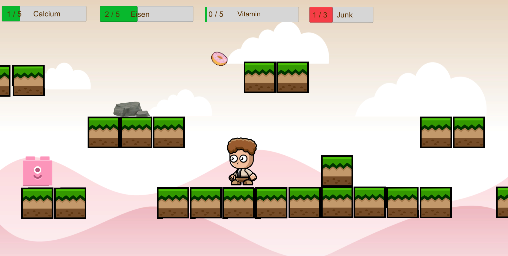
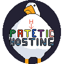

# Hetzner Game Jam 2025

To get you started you can take a look at [hgj-getting-started](https://github.com/hetzneronline/hgj-getting-started.git).

If you participated in the Hetzner Game Jam, please open a pull request adding your game to the list of games.
It would also be nice if you could add a screenshot (either to your own repository, or here)
If you need help with that, just contact us.

---

Here is a list of awesome games developed during the Hetzner Game Jam 2025:

[comment]: <> (add your game to this list, you can find an example at the end of this file)

Paws on the Wire
-----------------------

- Link: [Jetzt Spielen](https://github.com/Raevren/hetznergamejam2025/blob/main/README.md)
- Contributors:
  - [Nico](https://github.com/Raevren)
  - [Johanna](https://github.com/jxna4))
  - [Selina](https://github.com/xL1nkl3))
  - [Pascal](https://github.com/PascalHelmerich)
- Description: In Paws on the Wire, you control a brave bear who must prove his balance on a high wire at dizzying heights. By alternately pressing **A** and **D**, you guide him step by step across the tightrope. Quick reflexes are essential — during the walk, quick-time events will test your nerves and timing!

---

Baguette Ballett
----------------

- Link: [https://github.com/baguette-ballett/baguette-ballett](https://github.com/baguette-ballett/baguette-ballett)
- Contributors:
  - [atmidian](https://github.com/atmidian)
  - [burned42](https://github.com/burned42)
  - [EduardBaer](https://github.com/EduardBaer)
  - [entensee403](https://github.com/entensee403)
  - [RobertRenk](https://github.com/RobertRenk)
  - [ThomasChr](https://github.com/ThomasChr)
- Description: Mother duck needs to feed her children and luckily there's a boy with lots of baguettes. Be efficient and _balance_ the baguettes on your head, so you need less trips to the pond to feed your ducklings.

---

Food Balance
-----------------------

- Link: [https://github.com/nataly-devqa/gamejam-2025-food-balance](https://github.com/nataly-devqa/gamejam-2025-food-balance)
- Contributors:
  - [nataly-devqa](https://github.com/nataly-devqa)
  - [devbydiana](https://github.com/DevByDiana)
  - [sasukiuchiha03](https://github.com/SasukeUchiha03)
  - [Stefan Kuehne]
- Description: Your body needs nutrients – and junk food won’t help! In Nutribalance, you catch healthy foods like milk, iron, and vitamins falling from the sky. But watch out: three donuts are enough to ruin everything. Find the perfect nutritional balance to win!

---

Pathetic Hosting
----------------

- Link: 
  - [https://github.com/Joinsider/HetznerGamejam2025](https://github.com/Joinsider/HetznerGamejam2025)
  - [https://hennielp.itch.io/pathetic-hosting](https://hennielp.itch.io/pathetic-hosting)
- Contributors:
  - [HennieLP](https://github.com/HennieLP)
  - [Joinsider](https://github.com/Joinsider)
  - [Placeblock](https://github.com/Placeblock)
  - Thea

- Description: Ever wanted to build your own hosting company and be mean at the same time? Well, you're totally at the right place at the right time! Introducing: Pathetic Hosting! Start your company, upgrade your servers, and attack the enemy. But be careful! The load on your servers rises quickly! Do you upgrade your servers to withstand the load, or spend money to attack and damage your opponent? It's totally up to you, but your company is ruined blazing fast. The right balance is what matters!

---
Mirror Dash
----------------

- Link: [https://github.com/MikaStiebitz/Mirror-Dash](https://github.com/MikaStiebitz/Mirror-Dash)
- Contributors:
  - [Mika Stiebitz](https://github.com/MikaStiebitz)
  - [Nico Fuchs](https://github.com/nico-byte)
  - [Matthias Laton](https://github.com/20DragonSlayer01)
  - [Josef Graf](https://github.com/Eikligan)
  - Robin Korn
- Description: Experience a unique cooperative platform adventure where perspective matters! In this multiplayer browser game, players navigate through challenging levels with a twist - each player sees their own character in the top half of the screen while viewing their partner in a mirrored world below. Coordinate your movements, avoid hazards, and reach the finish line together as you navigate through increasingly difficult platforming challenges where what you see isn't necessarily what your partner sees.
---

Quacksalber
----------------
- Link: https://github.com/hedwigmiau/Quaksalber
- Contributors:
  - [Nilo](https://github.com/hedwigmiau)
  - Annakonda
- Description: The duck pharmacist wants to heal its customers. Either it succeeds in restoring the animals' inner balance or its clients suffer negative consequences.

---

ChaosLab
-----------------------

- Link: https://github.com/Changeable99/GameJam
- Contributors:
  - Felix Nutz
  - Paul Debus
  - Markus Zankel
- Description: This Game is about managing your chaotic laboratory.

---

MyAwesomeGame (example)
-----------------------

- Link: [add a link to your game here]
- Contributors:
  - [add all game jammers that contributed to this game]
- Description: This Game is not a Game, it is an example only.

---

Interested in games developed during our previous Game Jams?
You can find all previous events here:

* [Hetzner Game Jam 2023](hetzner_game_jam_2023.md).
* [Hetzner Game Jam 2019](hetzner_game_jam_2019.md).
