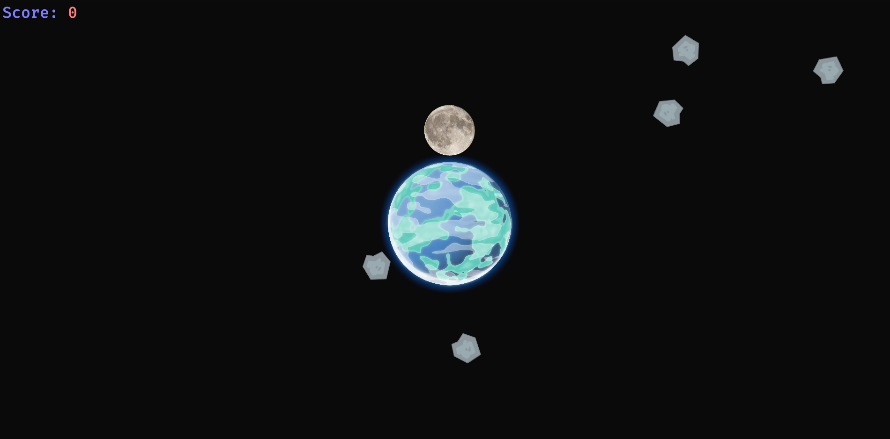
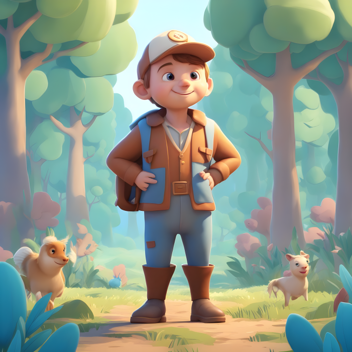
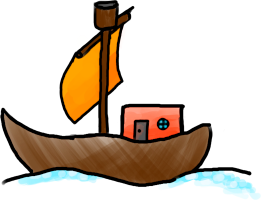

# Hetzner Game Jam 2023

To get you started you can take a look at [hgj-getting-started](https://github.com/hetzneronline/hgj-getting-started.git).

If you participated in the Hetzner Game Jam, please open a pull request adding your game to the list of games.
It would also be nice if you could add a screenshot (either to your own repository, or here)
If you need help with that, just contact us.

---

Here is a list of awesome games developed during the Hetzner Game Jam 2023:

[comment]: <> (add your game to this list, you can find an example at the end of this file)

Roundtrip
---------

- Link: [https://github.com/project-roundtrip/roundtrip](https://github.com/project-roundtrip/roundtrip)
- Contributors:
  - [burned42](https://github.com/burned42)
  - [EduardBaer](https://github.com/EduardBaer)
  - [noriakisana](https://github.com/noriakisana)
  - [Hayajiro](https://github.com/Hayajiro)
  - [justrenworks](https://github.com/justrenworks)
- Description: You're a wizard and you need to get down to the dungeon in an endless cycle down the staircase. Fight your way through different monsters each vulnerable to specific elements. Luckily as a wizard you know some spells combining different elements to defeat the monsters.

Endless Voyage
--------------

- Link: [https://github.com/EndlessVoyage/endlessVoyage](https://github.com/EndlessVoyage/endlessVoyage)
- Contributors:
  - [entensee403](https://github.com/entensee403)
  - [Bennyyuke](https://github.com/Bennyyuke)
  - [Seoholy](https://github.com/Seoholy)
  - [JanicCode](https://github.com/JanicCode)
  - [ThomasChr](https://github.com/ThomasChr)
- Description: You are a sailor waking up (drunk) on your ship. Everyone seems to be gone, and you're racing towards your death.

Chomp & Chew
------------

- Link: [https://github.com/ChrisDrake6/HetznerGameJam/](https://github.com/ChrisDrake6/HetznerGameJam/)
- Contributors:
  - Annika Sening [@annikasen](https://github.com/annikasen)
  - Jasper Fox [@JayBeeEff](https://github.com/JayBeeEff)
  - Robert Renkenberger [@RobertRenk](https://github.com/RobertRenk)
  - Maximilian Beck [@milihamster](https://github.com/milihamster)
  - Christoph Ehrig [@ChrisDrake6](https://github.com/ChrisDrake6)
  - Bastian Reuther [@bastifpv](https://github.com/bastifpv)
- Description: In Chomp and Chew drehst du am Rad der Evolution. Du frisst andere Tiere, um zu wachsen und die Tierwelt zu dominieren. Bist du bereit, dich in diesen tierischen Cycle zu stürzen?

Mooncycle
---------

- Link: [https://github.com/mooncycle-project/mooncycle](https://github.com/mooncycle-project/mooncycle)
- Contributors:
  - [@j-brn](https://github.com/j-brn)
  - [@susa0](https://github.com/susa0)
  - [@jgero](https://github.com/jgero)
  - [@mucer](https://github.com/mucer)
- Description: Rette die Erde mit Hilfe des Mondes vor Asteroiden und Kometen. Wehre die Asteroiden ab indem du sie wegkickst.

Uwe - Das U ist fast ein Kreis
------------------------------

- Link: [Itch.io](https://flipez.itch.io/herzmut-games-hgj2023), [Github](https://github.com/Herzmut-Games/hgj-2023)
- Mitwirkende:
  - Robert
  - Marv
  - Alex
  - Joshi (Twitch Engineer)
  - Lars (Sound Engineer)
- Beschreibung: Uwes Kopf dreht sich im Kreis, vier Jahre nachdem er sich gegen seltsame elementare Monster [verteidigen musste](https://github.com/Herzmut-Games/uwe) wacht er nun nach einem langen Wochenende im Wald auf und versucht nicht zu sterben.

---

TidalHarvest 
-----------------------

- Link: [https://github.com/konrad2002/TidalHarvest]
- Contributors:
  - [Carmen, Konrad, Paul]
- Description: Build your farm :)

---

MyAwesomeGame (example)
-----------------------

- Link: [add a link to your game here]
- Contributors:
  - [add all game jammers that contributed to this game]
- Description: This Game is not a Game, it is an example only.

---

You can find the games developed during Hetzner Game Jam 2019 [here](hetzner_game_jam_2019.md).
