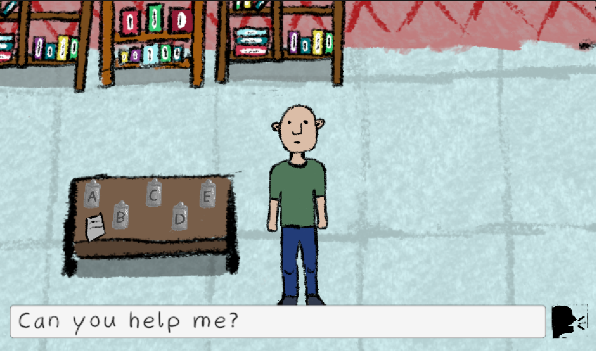

# Escape Room 2025

A 2D top-down puzzle adventure game developed in Unity. Navigate through rooms, solve puzzles, and discover the secrets hidden throughout the environment. Key to success is balancing discovering the rooms on your own and asking the AI model for guidance.



## Game Overview

In Escape Room 2025, players navigate through a series of interconnected rooms, solving puzzles by manipulating objects in the environment. The core gameplay revolves around finding and using carriable objects, activating mechanisms, and discovering the path forward.

### Key Features

- **Interactive Environment**: Interact with various objects in the game world
- **Puzzle-Based Gameplay**: Solve puzzles by finding and placing objects in the right locations
- **Top-Down Movement**: Control your character with WASD or arrow keys
- **Air Vent System**: Central puzzle mechanic that requires finding and placing specific objects
- **Multiple Rooms**: Navigate through different areas with unique challenges

## Controls

- **Movement**: WASD or Arrow Keys
- **Interaction**: E (when near interactable objects)
- **Pick up/Drop Objects**: E (when near carriable objects)

## Game Mechanics

### Player Movement
The player moves in a top-down 2D environment using a physics-based controller. The character automatically faces the direction of movement.

### Interaction System
When the player approaches an interactive object, it highlights and displays a prompt. Pressing E triggers the interaction.

### Carriable Objects
Players can pick up, carry, and drop small objects like apples. These objects can be used to solve puzzles throughout the game.

### AI-Powered Character Interaction
The game features an advanced AI character interaction system powered by the Ollama Large Language Model (LLM). Players can engage with in-game characters through natural language conversations:

- **Dynamic Dialogue**: Converse with NPCs using natural language
- **Context-Aware Responses**: The AI remembers previous interactions and responds accordingly
- **Guided Puzzle Solving**: AI characters provide subtle hints and guidance based on the player's progress
- **Deceptive Characters**: Some AI characters may have hidden agendas - be cautious who you trust!

Each NPC has a unique personality and knowledge base, allowing for immersive and varied interactions. The dialogue is processed through a Flask server that communicates with the Ollama model.

### Air Vents
Air vents are special receivers that can accept specific types of objects. When the required number of objects are placed in an air vent, it may unlock doors, activate mechanisms, or trigger events.

### Scene Transitions
Moving to specific areas or solving certain puzzles allows progression to new rooms or levels.

## Development Details

### Built With
- Unity 2022.3.18f1
- C# for scripting
- 2D sprites and assets

### Key Scripts

- **PlayerController**: Handles player movement and input
- **InteractiveObject**: Base class for all objects that can be interacted with
- **CarriableObject**: Objects that can be picked up and carried
- **ObjectReceiver**: Base class for objects that can accept carriable items
- **AirVent**: Special receiver with suction forces and puzzle mechanics
- **SceneTransition**: Handles movement between scenes/rooms

## Installation & Setup

1. Clone the repository
2. Open the project with Unity 2022.3.18f1 or later
3. Open the starting scene in `Assets/Scenes`
4. Press Play to test the game

### Python Environment Setup

For the AI character interaction system, you'll need to set up the Python environment:

#### Windows Setup
1. Install Python 3.8+ if not already installed
2. Navigate to the src/python directory:
   ```
   cd h:\GameJam2025\src\python
   ```
3. Run the setup script:
   ```
   python server_setup.py
   ```
4. Follow the prompts to complete the server setup

#### Linux Setup
1. Install Python 3.8+ if not already installed:
   ```bash
   sudo apt update
   sudo apt install python3 python3-pip python3-venv
   ```
2. Navigate to the src/python directory:
   ```bash
   cd /path/to/GameJam2025/src/python
   ```
3. Run the setup script:
   ```bash
   python3 server_setup.py
   ```
4. Follow the prompts to complete the server setup

### Ollama 38B Model Setup

For advanced AI-powered NPCs and dialogue systems, this project uses the Ollama 38B LLM. Follow these instructions to set it up:

#### Windows Setup
1. Download Ollama from the [official website](https://ollama.com/download/windows)
2. Install Ollama by running the downloaded installer
3. Open Command Prompt or PowerShell and run:
   ```
   ollama pull llama3:38b
   ```
4. Start the Ollama service:
   ```
   ollama serve
   ```
5. Verify installation by running:
   ```
   ollama run llama3:38b "Hello, Escape Room 2025!"
   ```

#### Linux Setup
1. Install Ollama using the following command:
   ```bash
   curl -fsSL https://ollama.com/install.sh | sh
   ```
2. Pull the 38B model:
   ```bash
   ollama pull llama3:38b
   ```
3. Start the Ollama service:
   ```bash
   ollama serve
   ```
4. Verify installation by running:
   ```bash
   ollama run llama3:38b "Hello, Escape Room 2025!"
   ```

**Note**: The 38B model requires at least 32GB of RAM and a GPU with 40GB+ VRAM for optimal performance. For systems with lower specifications, consider using the 8B model variant instead (`ollama pull llama3:8b`).

### Flask Server & Tailscale Setup

The game utilizes a Python Flask server for AI NPC interactions. This server connects to the Ollama model and provides an API for the game to access. Follow these steps to set up the server and networking:

#### Server Setup (Development Machine)
1. Install Python 3.8+ if not already installed
2. Install required Python packages:
   ```bash
   pip install flask requests cryptography tailscale
   ```
3. Navigate to the server directory:
   ```bash
   cd h:\GameJam2025\src\python
   ```
4. Run the server script:
   ```bash
   python ollama_api.py
   ```
5. The server should start on port 5000 and display the first 10 characters of the API key

#### Client Setup (Game Machine)
1. Install Python 3.8+ if not already installed
2. Install required Python packages:
   ```bash
   pip install flask requests
   ```
3. Navigate to the client directory:
   ```bash
   cd h:\GameJam2025\src\python
   ```
4. Copy the API key from the server to `client_key.key`
5. Run the client script to test the connection:
   ```bash
   python query_llm.py
   ```

#### Tailscale Setup (For Remote Connections)
1. Download and install Tailscale from [the official website](https://tailscale.com/download)
2. Install on both server and client machines
3. Sign in to Tailscale on both machines using the same account
4. Find the Tailscale IP of your server machine from the Tailscale admin console
5. Update the `TAILSCALE_IP` variable in `query_llm.py` with your server's Tailscale IP:
   ```python
   TAILSCALE_IP = "your.tailscale.ip"  # Replace with your server's Tailscale IP
   ```
6. Ensure port 5000 is allowed in any firewall settings

**Note**: The Flask server and Ollama should be running on the same machine for optimal performance.

## Requirements

### Unity Version
- Unity 2022.3.18f1 or later

### Required Packages
- 2D Sprite
- TextMeshPro
- Universal Render Pipeline (URP)

## Credits

- Developed for GameJam 2025
- Programming and Building the Environment: 
  - Leonhard Behr (leonhard-behr)
  - Thilo Eichinger (eich302)
  - Laurin Klein (klein2712)
- Art Assets:  Patricia Glas (Paddi1234)
<!-- - Sound Design: [Sound Sources] -->

## License

This project is licensed under the Apache License 2.0 - see the LICENSE file for details.

## Future Development

- Additional levels and puzzles
- More interactive objects
- Enhanced visual effects
- Controller support
